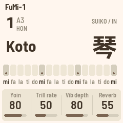
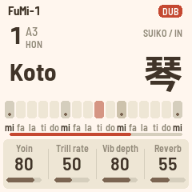

# FuMi-1 for the M-VAVE FM-1

FuMi-1 (文) turns the M-VAVE FM-1 into a shigin conductor inspired by the Suiko ST-50, the Japanese
poetry-accompaniment instrument. The sixteen white keys are the ST-50's lower row: mi fa la ti do, three
times, and a top mi. The black keys are its upper row (fa♯ sol ti♭ do♯ re) or, at the flick of a button,
koto ornaments. The key is set in 本数 (水4 to 12本), the tuning switches between 平均律 and the ST-50's
純正律 as measured from recordings, and the sounds are a koto and twelve more on a 6-operator FM engine,
with 余韻 (ring time), vibrato, trill, a sprung pitch bend on the octave buttons, a looper on REC, and a
subtle plate reverb.

It is built on [FoMni](https://github.com/charlesvestal/fm1-omnichord)'s platform (Felucca's HAL, update
loader, USB, storage, screen driver, installer and browser emulator), which is kept byte-for-byte: all of
FuMi lives in `firmware/src/app/` and `firmware/src/dsp/`.

- **Play it in your browser** (no FM-1 needed): <https://cartesive.github.io/fumi-1/emu/>
- **Install it** (Chrome or Edge, FM-1 on USB): <https://cartesive.github.io/fumi-1/install/>
- **The audition bench**: <https://cartesive.github.io/fumi-1/bench/>

 

**Status (10 Oct 2026):** version 1.0.5 (identity `FM-1_7010005`). It has run on one FM-1, the author's,
since 0.1. What works: the pitch core and the measured tuning, thirteen instruments with their names in
kanji, the bends, ornaments, vibrato, trill, 余韻, mono with slide, the voicing stages, reverb, MIDI in and
out, the looper, the host simulator, the browser emulator, the audition bench and the web installer. What
is next: a loop that survives power-off and key slide for the shakuhachi. Releases are listed in `docs/CHANGELOG.md`; the research and the plan are in `docs/research/`
(`00-START-HERE.md` is the current truth).

FuMi-1 is quieter than the stock firmware at the same MASTER setting, as the Suiko is a gentle
instrument: turn MASTER up. Turn it down again before switching back to another firmware.

## Sixty seconds

1. Play the white keys left to right: that is the scale, three octaves.
2. Tap SEL to hear the tuning change between 平均律 and 純正律.
3. Hold a note and press OCT+: the pitch bends up and springs back.
4. Turn PRESETS for the other instruments, SELECT for the key.
5. Tap REC, play a phrase, tap REC again: it loops. Play over it.

## Before you install

Custom firmware is installed at your own risk. The FM-1 has a single copy of its firmware and no recovery
button; a failed install can leave it unable to start.

- **Be on M-VAVE's official V15 first.** FuMi-1, like the other community firmwares, expects it. Check with
  `python3 tools/fm1_install.py --info`: stock V15 reports `FM-1_015`.
- **Download and keep M-VAVE's `FM-1.fwsc` (V15)** from [m-vave.com/download](https://www.m-vave.com/download).
  It is your way back.
- Charge the battery, use a direct USB data cable (no hub), use Chrome or Edge, and close any DAW or other
  tab using MIDI. Do not unplug until the installer says it is done.
- **Coming from another custom firmware?** Go back to official V15 first, then install FuMi-1. Saved data
  from other firmwares is not read.
- FuMi-1 has been run on one FM-1 (the author's). Please report what you find in
  [Issues](https://github.com/cartesive/fumi-1/issues).

### Getting back

- **To official V15:** the installer page's "Back to the stock firmware" with M-VAVE's `FM-1.fwsc` (it
  accepts exactly that file), or M-VAVE's own M-UPGRADE.
- **Update mode from FuMi-1:** hold OCT− and OCT+ together for 5 seconds (a countdown appears after 2 s).
- **If FuMi-1 crashes while starting:** it restarts; after two failed starts in a row it comes up in a safe
  mode with no sound and USB on, which accepts an install from the installer page.
- **Black screen, and the computer sees a device called WL80UBOOT:** the chip is in its own download
  mode. `tools/fm1_rescue.py FM-1.fwsc` (macOS, no extra hardware) backs the flash up and puts V15 back.
  Otherwise recovery needs [FM-1 Transporter](https://github.com/kurogedelic/FM-1-transporter).

## Playing

| Control | Does |
|---|---|
| White keys 1–16 | mi fa la ti do × 3 and a top mi. The tonics (1, 6, 11, 16) are lit. 三 is key 6 |
| Black keys | The upper row fa♯ sol ti♭ do♯ re, five per octave. **SEQ** switches them to ornaments: vibrato, trill, damp, strong pluck (keys 1–4 and 6–9) |
| SELECT | 本数: 水4, 水3, 水2, 水1, 1 … 12. At 1本, 三 = A3 and key 1 = A2 |
| PRESETS | 音色, the instrument |
| ALGORITHM | The scale: IN 陰 (mi fa la ti do), YŌ 陽 (fa and do raised), MIN'YŌ 民謡 (raised a whole tone) |
| KNOB 1–4 | The four values of the page. HOME: 余韻, trill rate, vibrato depth, reverb. FX: low cut, high cut, character, reverb size. EDIT: bend target, bend down, bend time, slide time. ENV (Loop): BPM, beats, click. Tuning page: tuning, depth, 微調, A |
| LFO | ビブラート on / off |
| ARP | トリラー on / off: the held note re-plucked at the rate, each repeat a little different. On the wood blocks and the taiko, a roll |
| GLO | 単音 / 和音 (mono / poly) |
| SEL | Tap: 平均律 ↔ 純正律. Hold: the tuning page (EQUAL, SUIKO, KOTO pure fifths, USER; depth; 微調 ±50 cents; A = 430–445) |
| OCT− / OCT+ | With a note held: the 音程 rocker, a sprung bend down (−40 cents) / up (a semitone, a whole tone or the next scale note). With no note held: octave down / up |
| OCT− + OCT+ held 5 s | Update mode (the platform's; never reassigned) |
| REC | The looper: tap to arm, the first key starts the loop; tap again to close it, it plays; while it plays, overdub on / off. Hold a second: clear |
| PLAY | Stop / start the loop from the top. Hold a second: undo the last layer |
| ENV | The Loop page: BPM, length in beats, click |
| MASTER | Volume and 強弱: play fade-ins on it by hand, as on the ST-50 |
| SAVE | Saves the setup (it also autosaves a few seconds after a change, when quiet) |

MIDI in (USB and the TRS jack) plays the voice chromatically; key presses go out as notes on channel 1.

## The looper

The ST-50's 自動伴奏 section was 記憶, 再生, 停止: record a performance, play it back, play another voice
over it. FuMi's looper is that, on two buttons and with no grid: notes are kept at the moment they were
played, nothing is quantised.

- **REC** tap with nothing recorded: armed. The loop starts on the first key you press, not on the tap.
  REC tap while recording: the loop closes at that moment and starts playing. If you never press REC a
  second time it closes itself at the ruler's length: 32 beats at 60 BPM, a 32-second loop, by default.
  REC tap while the loop plays: overdub on; again: off. Each overdub is a layer.
- **PLAY** tap: stop, or start from the top. PLAY held a second: undo the last layer. REC held a second:
  clear the loop (the screen asks you to keep holding).
- **ENV** is the Loop page: BPM 30–120, length 8–64 beats, and a quiet click on the beat, off by default.
  The ruler only decides where the loop ends by itself and where the click falls.
- Recorded: the keys, the ornament keys and the bend buttons, with their timing. Not recorded: knob moves,
  the LFO, ARP and GLO buttons, and MASTER, so your left hand shapes the level of everything live.
- The loop stores keys, not pitches: change 本数 or the tuning while it plays and the loop follows. Notes
  ringing across the join keep ringing. A note still held when a layer ends is let go in the recording.
- Each layer keeps the instrument it was recorded in. Loop a koto phrase, turn PRESETS to the shakuhachi
  and play over it: the koto goes on being a koto under your shakuhachi, and an overdub now is a
  shakuhachi layer. A layer's instrument is the one playing at its first note; a loop holds up to eight
  instruments at once. The eight voices are shared between the loop and your hands. The loop lives in
  memory until the FM-1 is switched off; it does not go out over MIDI.
  REC lights red while recording and blinks while armed; PLAY lights while the loop plays; a thin bar under
  the keys shows where the loop is. Nothing autosaves while a loop runs.

## Why the tuning matters

The ST-50's 純正律 is not a textbook just intonation: measured from two recordings in two keys, fa sits
20.8 cents below equal temperament and do 16.0 cents below, within a cent of each other across the
recordings, and ti♭ about 25 cents below (one recording, less sure). That is what SUIKO plays; EQUAL is
平均律, KOTO is pure fifths and fourths, USER is your own trims. The measurements are in
`docs/research/13-audio-analysis-tuning-measured.md` and `14-second-recording-tuning-confirmed.md`.

| Degree | 平均律 | SUIKO as measured |
|---|---|---|
| mi | 0 | 0 |
| fa | 0 | −20.8 cents |
| la | 0 | 0 |
| ti♭ (upper row) | 0 | −25 cents |
| ti | 0 | 0 |
| do | 0 | −16.0 cents |

## Building and testing

See [BUILDING.md](BUILDING.md) and `docs/dev-environment.md`.

```
tests/run_tests.sh      # the guard, the pitch core, the FM6 core, the instrument and the looper, the click
                        # test, the simulator scenarios, the browser build, the tools' self-tests
./build.sh              # build/fumi.fwsc (Docker, JieLi toolchain)
web/emu/build.sh        # the browser emulator and the audition bench (Emscripten)
web/bench/serve.py      # then open http://localhost:8765/build/bench/
```

`build/host/fumi_host SCRIPT OUTDIR` runs the whole app on a computer from a script
(`tests/scenarios/*.fumi`), with audio and screenshots coming out. It builds on macOS and Linux.

## The instruments

PRESETS steps through the built-in instruments; the screen shows each one's name with its Japanese name
beneath, Suiko-style. Seven are the owner's picks from community DX7 banks on patches.fm (each entry in
`tools/fumi_patches.py` names its bank and author); six are FuMi's own.

| # | Name | 名 | From |
|---|---|---|---|
| 1 | Koto | 琴 | N-KOTO-A5, a community patch. The boot instrument |
| 2 | Koto II | 箏 | KOTO-KOTO, a community patch |
| 3 | Sho | 笙 | Air---*--3, a community patch |
| 4 | Shakuhachi | 尺八 | PAN FL T A, a community patch |
| 5 | Dragon Flt | 龍笛 | ALTO FLUTE, a community patch |
| 6 | Bamboo Flt | 篠笛 | Bamboo Flt, a community patch |
| 7 | Taiko | 太鼓 | Timpani.2 by Tim Garrett |
| 8 | Hyoshigi | 拍子木 | **FuMi's own**: two hardwood sticks, a dry crack, the same on every key |
| 9 | Mokugyo | 木魚 | **FuMi's own**: the wooden fish, a round pitched tok |
| 10 | Koto Pluck | 爪音 | **FuMi's own**, found by `tools/koto_search.c` against the ST-50 measurements |
| 11 | Koto Ring | 響 | **FuMi's own**, brighter |
| 12 | Koto Warm | 名残 | **FuMi's own**, rounder |
| 13 | Harp | 箜篌 | **FuMi's own** |

No Yamaha factory ROM voice is among them (a ROM2B pick was declined). The kanji come from Noto Sans CJK
(SIL OFL 1.1) through `tools/gen_kanji.py`, which keeps only the characters these names use.

## The audition bench

Voicing happens in the browser, on FuMi's real engine (`web/bench/`, see `docs/research/16-audition-bench.md`):
patches from any DX7 `.syx` and FuMi's own, instant switching, A/B and blind A/B, a morph between two
patches, every patch byte on a slider, the voicing stages (low cut, high cut, character, reverb), 本数 and
調律, FuMi's key layout on the computer keyboard, Web MIDI, stock phrases, reference clips from `refs/`
level-matched, notes and ratings per patch, a session file saved into `bench/sessions/`, and a `.syx` bank
of the finalists to load on the FM-1's stock firmware for the speaker check.

It is also online at **https://cartesive.github.io/fumi-1/bench/**: there the `.syx` banks and the recordings
come from your own disk (Load .syx…, Load audio…) and stay in the browser; an exported session is a download
to put into `bench/sessions/`.

## Tools

- `tools/analyze_ref.py`: reference-audio analysis (pitch per note, spectral peaks, attack, click, decay, partials).
- `tools/syx_dump.py`: dump and diff DX7 voices.
- `tools/fumi_patches.py`: the built-in patches, as readable operator settings, into `fumi_patches.h`.
- `tools/koto_search.c`: a search over the engine's settings against the ST-50 koto measurements (how KOTO A and B were found).
- `tools/gen_fm6_tables.py`: the FM6 core's tables.
- `tools/guard_platform.sh`: fails if any protected platform file differs from upstream FoMni.

## Where to talk

[Issues](https://github.com/cartesive/fumi-1/issues) on GitHub, for what you find and what you would like.
The roadmap, in short: a loop that survives power-off, key slide for the shakuhachi.

## Credits

The platform (hardware layer, USB, update loader, storage, installer, host simulator, browser emulator) is
[Felucca](https://github.com/hugelton/Felucca)'s by Leo Kuroshita (Hügelton Instruments), by way of
[X0X](https://github.com/charlesvestal/fm1-x0x) and [FoMni](https://github.com/charlesvestal/fm1-omnichord)
by Charles Vestal. The 6-operator FM core is Felucca's C port of msfa (Dexed, Google and Pascal Gauthier,
Apache-2.0). The plate reverb (Dattorro) is FoMni's. GPL-3.0-only; see [LICENSING.md](LICENSING.md).

Suiko and ST-50 are names of 水光社 (Suikohsha). FuMi-1 is inspired by the ST-50 and is not affiliated with
or endorsed by Suikohsha, M-VAVE or Hügelton Instruments. Yamaha DX7 patch data is read by the bench for
listening only and is never part of FuMi.
